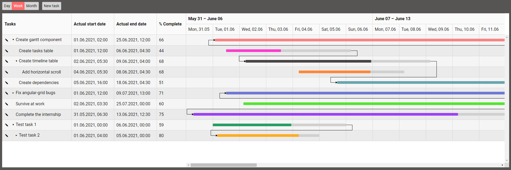

# Angular simple gantt project

# How can you use this project?
As an example for creating your own gantt on Angular

# Demo
You can follow [the link](https://overfirst.github.io/angular-gantt/) for watching a demo.

# Browser support
For latest versions of:
- Chrome
- Opera
- Edge
- Yandex.Browser

# Development
- Clone this repository
- Run the `npm install` command in the root of the repository
- Run the `npm run start` command to start the local development server
